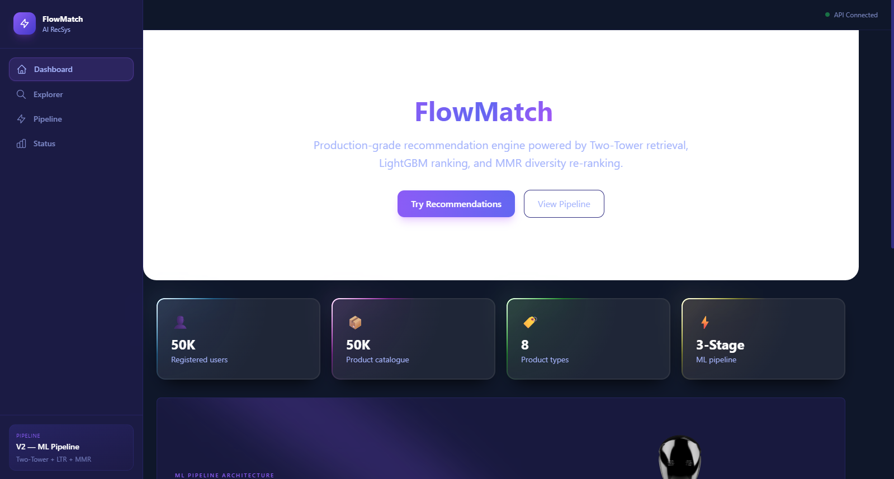
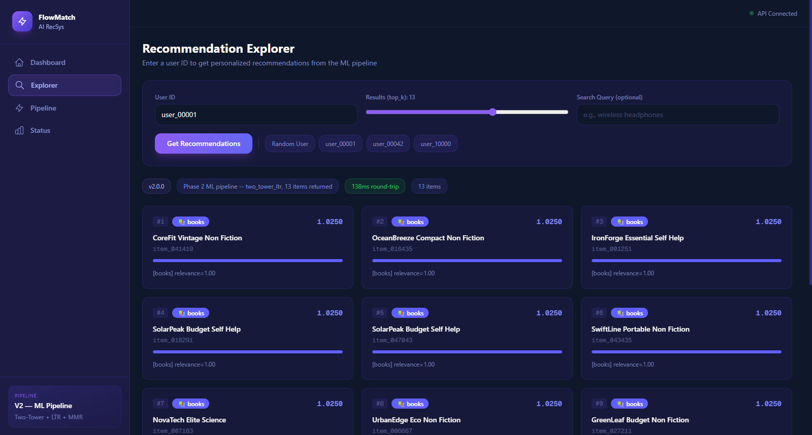
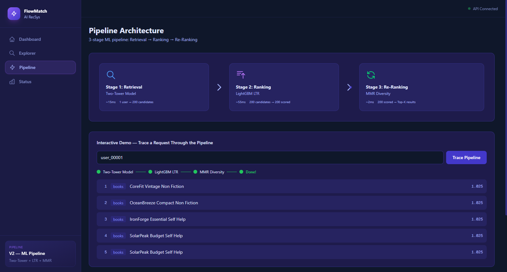
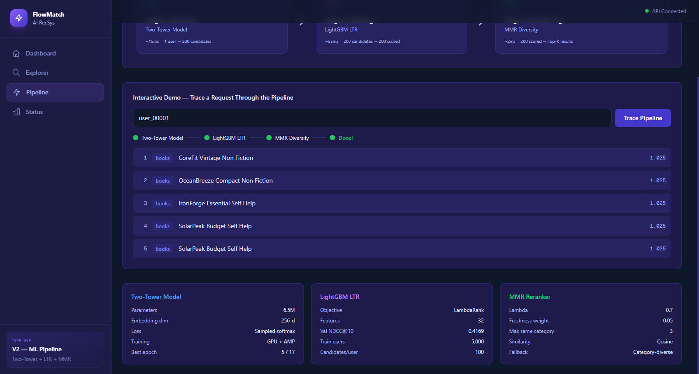

# FlowMatch AI Recommendation System

A production-grade AI recommendation engine built as a monorepo with **10 microservices**, **4 custom-trained ML models**, and a **3-stage inference pipeline**. Trained on GPU (RTX 5070 via WSL2 + PyTorch 2.10 + CUDA 12.8) with AMP mixed precision.



---

## Architecture

```
Client Request
      │
      ▼
┌──────────────┐     ┌─────────────────────────────────────────────┐
│  Next.js     │────▶│              API Gateway (FastAPI)          │
│  Frontend    │     │  Auto-detects V1 (content) or V2 (ML)      │
└──────────────┘     └──────────────┬──────────────────────────────┘
                                    │
                     ┌──────────────▼──────────────────┐
                     │    Stage 1: Two-Tower Retrieval  │  ~15ms
                     │    6.5M params, 256-d embeddings │
                     │    ANN search → 200 candidates   │
                     └──────────────┬──────────────────┘
                                    │
                     ┌──────────────▼──────────────────┐
                     │    Stage 2: LightGBM LTR         │  ~55ms
                     │    32 features, LambdaRank       │
                     │    NDCG@10 = 0.4169              │
                     └──────────────┬──────────────────┘
                                    │
                     ┌──────────────▼──────────────────┐
                     │    Stage 3: MMR Re-Ranking       │  ~2ms
                     │    λ=0.7, max 3/category        │
                     │    Diversity + freshness boost    │
                     └──────────────┬──────────────────┘
                                    │
                                    ▼
                              Top-K Results
```

---

## Tech Stack

| Layer | Technology |
|-------|-----------|
| **Backend** | Python 3.12, FastAPI, Pydantic v2, structlog |
| **ML Models** | PyTorch 2.10, LightGBM, Sentence-Transformers |
| **Frontend** | Next.js 16, React 19, Tailwind CSS 4, Framer Motion, Spline 3D |
| **Databases** | PostgreSQL 16, Redis 7, Qdrant 1.9.7 |
| **Messaging** | Apache Kafka |
| **Monitoring** | Prometheus, Grafana (RED metrics) |
| **Deployment** | Docker Compose, Kubernetes (12 manifests), GitHub Actions CI |
| **Training** | WSL2 + RTX 5070 GPU + CUDA 12.8 + AMP mixed precision |

---

## Services

| Service | Port | Description |
|---------|------|-------------|
| API Gateway | 8000 | Entry point, orchestrates the recommendation pipeline |
| Event Collector | 8001 | Kafka-backed user event ingestion |
| User Feature Service | 8002 | Redis-backed feature store (user, item, session) |
| Ranking Service | 8003 | LightGBM LTR model serving |
| LLM Augment Service | 8004 | Natural language explanations & query parsing |
| Candidate Service | — | Two-Tower retrieval + Qdrant ANN search |
| Embedding Service | — | SentenceTransformer (all-MiniLM-L6-v2, 384-d) |
| Re-ranking Service | — | MMR diversity re-ranking + business rules |
| Training Pipeline | — | Model training (Two-Tower, NCF, LTR) |
| Shared Layer | — | Config, schemas, logging, metrics |

---

## ML Models

| Model | Params | Details |
|-------|--------|---------|
| **Two-Tower** | 6.5M | User/Item towers → 256-d embeddings, sampled softmax, temp=0.05. Best epoch 5/17, val_loss=6.2646 |
| **NCF** | 12.9M | GMF + MLP[256,128,64] fusion, raw logits (AMP-safe), 6 neg/pos. Best epoch 2/12, val_loss=0.3907 |
| **LightGBM LTR** | — | LambdaRank, 32 features, 5K train users, 100 candidates/user. Val NDCG@10=0.4169 |
| **MMR Reranker** | — | λ=0.7, cosine similarity, max 3/category, freshness weight=0.05 |

---

## Dataset

Synthetic data generated with vectorized NumPy operations:

- **50,000 users** — 20 taste clusters, age/gender demographics
- **50,000 items** — 8 categories, power-law popularity, log-normal prices
- **2,000,000 interactions** — view/click/cart/purchase funnel with 80% category affinity

---

## Quick Start

### Prerequisites

- Python 3.12+
- Node.js 18+ (for frontend)
- Docker & Docker Compose (optional, for infrastructure)

### Backend

```bash
# Install dependencies
pip install -r requirements.txt

# Generate synthetic data
python -m scripts.generate_synthetic_data

# Embed item catalogue
python -c "from services.embedding_svc.app.embedder import embed_catalogue; embed_catalogue()"

# Train models (requires GPU via WSL2 for best results)
python -m services.training_pipeline.app.train_two_tower
python -m services.training_pipeline.app.train_ncf
python -m services.training_pipeline.app.train_ltr

# Start API
uvicorn services.api_gateway.app.main:app --reload --port 8000
```

### Frontend

```bash
cd frontend
npm install
npm run dev
```

Open http://localhost:3000 — the frontend proxies API requests to the backend.

### Docker Compose (Full Stack)

```bash
docker-compose up
```

Starts PostgreSQL, Redis, Qdrant, Prometheus, Grafana, and all application services.

---

## Testing

```bash
# Run all 64 tests
pytest

# With coverage
pytest --cov=services --cov=shared

# Lint + type check
ruff check .
mypy shared/
```

Test pyramid: 39 unit, 23 integration, 2 E2E tests.

---

## Frontend Screenshots

### Dashboard


### Recommendation Explorer


### Pipeline Architecture



### System Status


---

## Project Structure

```
├── services/
│   ├── api_gateway/          # FastAPI entry point
│   ├── candidate_svc/        # Two-Tower retrieval + Qdrant
│   ├── embedding_svc/        # SentenceTransformer embeddings
│   ├── event_collector/      # Kafka event ingestion
│   ├── llm_augment_svc/      # LLM explanations
│   ├── ranking_svc/          # LightGBM LTR serving
│   ├── reranking_svc/        # MMR diversity re-ranking
│   ├── training_pipeline/    # Model training code
│   └── user_feature_svc/     # Redis feature store
├── shared/                   # Config, schemas, utils
├── frontend/                 # Next.js 16 dashboard
├── scripts/                  # Data generation, evaluation
├── tests/                    # Unit, integration, E2E
├── infra/
│   ├── k8s/                  # 12 Kubernetes manifests
│   ├── prometheus/           # Monitoring config
│   └── terraform/            # IaC (planned)
├── models/artifacts/         # Trained model files (git-ignored)
├── data/synthetic/           # Training data (git-ignored)
├── docker-compose.yml
├── pyproject.toml
├── Makefile
└── requirements.txt
```

---

## Documentation

- [PROJECT_PROGRESS.md](PROJECT_PROGRESS.md) — Phase completion tracking, model results, known issues
- [TECHNICAL_WALKTHROUGH.md](TECHNICAL_WALKTHROUGH.md) — Deep technical documentation of every component

---

## Environment Variables

See [.env.example](.env.example) for all configuration options. Key variables:

| Variable | Default | Description |
|----------|---------|-------------|
| `POSTGRES_HOST` | localhost | PostgreSQL host |
| `REDIS_HOST` | localhost | Redis host |
| `QDRANT_HOST` | localhost | Qdrant host |
| `CORS_ORIGINS` | * | Comma-separated allowed origins |
| `ANTHROPIC_API_KEY` | — | For LLM augmentation service |

---

Built by **Navnit**
