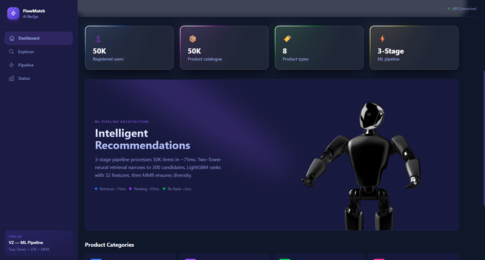
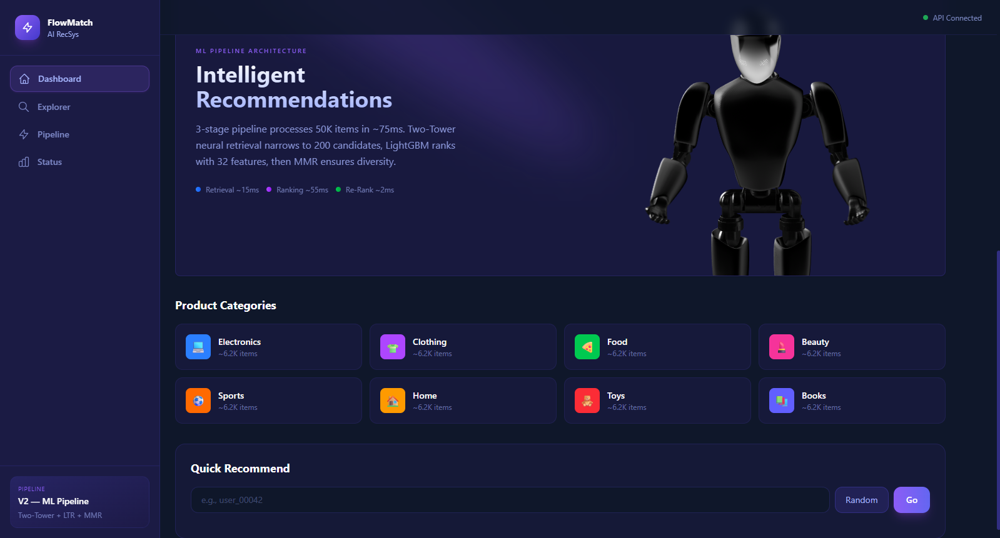
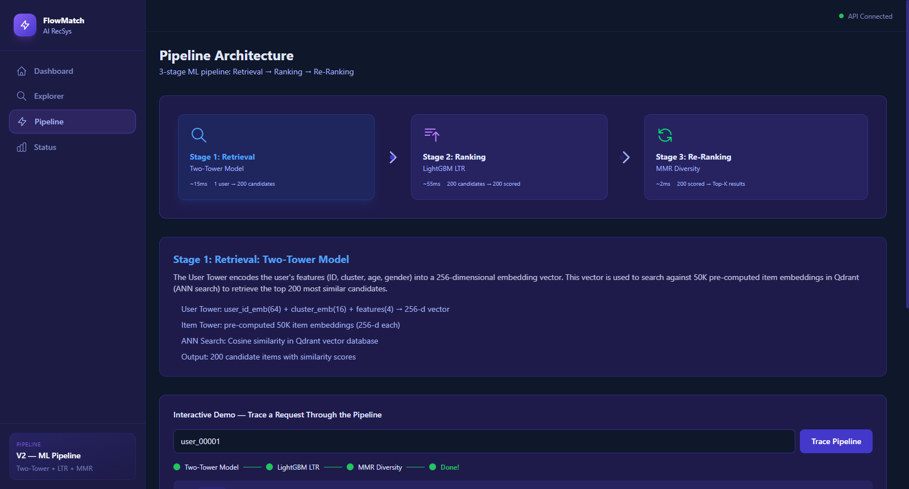
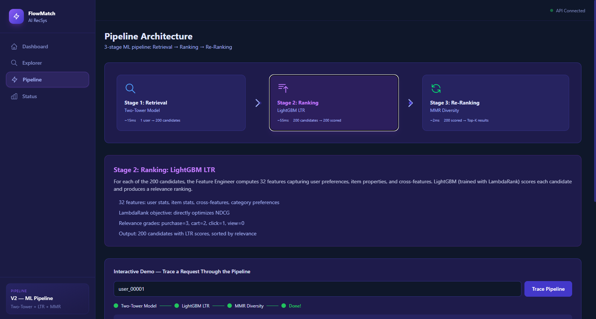
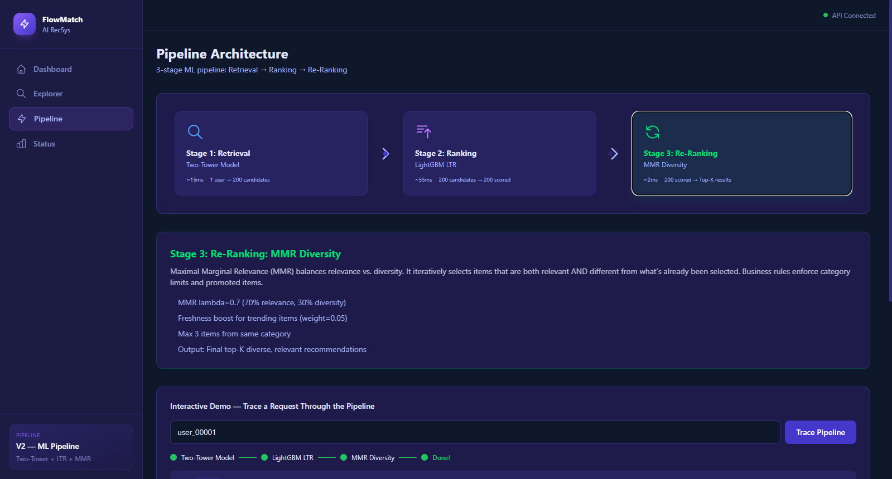
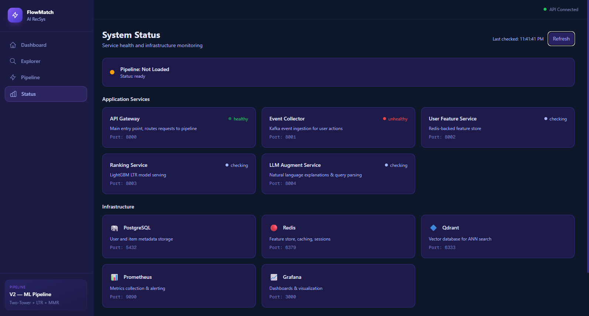

# FlowMatch AI Recommendation System

A production-grade AI recommendation engine powered by a **3-stage ML pipeline**: Two-Tower neural retrieval, LightGBM LTR ranking, and MMR diversity re-ranking. Built with Next.js, Tailwind CSS, and a FastAPI backend.


---

## Features

- **Dashboard** — Overview of the system with stats, 3D robot visualization, product categories, and quick recommendation widget
- **Recommendation Explorer** — Enter any user ID to get personalized recommendations from the ML pipeline with adjustable top-K and search query support
- **Pipeline Architecture** — Interactive visualization of the 3-stage ML pipeline with clickable stage details and live pipeline tracing demo
- **System Status** — Real-time health monitoring of all microservices and infrastructure components

---

## Screenshots

### Dashboard
The landing page showcases the system overview with animated particle effects, stat cards, and a 3D Spline robot.





### Recommendation Explorer
Enter a user ID to get personalized recommendations from the full ML pipeline. Supports random users, preset IDs, adjustable result count, and optional search queries.


### Pipeline Architecture
Interactive visualization of the 3-stage recommendation pipeline. Click any stage to expand detailed descriptions. Use the demo to trace a live request through Two-Tower → LightGBM LTR → MMR.







### System Status
Monitor the health of all application services and infrastructure components in real-time.


---

## Tech Stack

| Layer | Technology |
|-------|-----------|
| Frontend | Next.js 16, React 19, TypeScript |
| Styling | Tailwind CSS 4, Geist Fonts |
| Animations | Framer Motion, Simplex Noise (Vortex), Spline 3D |
| UI Components | Custom GlowCards, Spotlight effects, Vortex particles |
| API Layer | Next.js API Routes (proxy to FastAPI backend) |
| Backend | FastAPI, Python 3.11 |
| ML Models | Two-Tower (PyTorch), LightGBM LTR, MMR Reranker |
| Infrastructure | PostgreSQL, Redis, Qdrant, Kafka, Prometheus, Grafana |
| Deployment | Vercel (frontend), Docker Compose / Kubernetes (backend) |

---

## ML Pipeline Architecture

```
User Request
     │
     ▼
┌─────────────────────────────┐
│  Stage 1: Two-Tower Model   │  ~15ms
│  6.5M params, 256-d embed   │
│  ANN search → 200 candidates│
└─────────────┬───────────────┘
              │
              ▼
┌─────────────────────────────┐
│  Stage 2: LightGBM LTR     │  ~55ms
│  32 features, LambdaRank    │
│  NDCG@10 = 0.4169           │
└─────────────┬───────────────┘
              │
              ▼
┌─────────────────────────────┐
│  Stage 3: MMR Re-Ranking    │  ~2ms
│  λ=0.7, max 3/category     │
│  Freshness boost + diversity│
└─────────────┬───────────────┘
              │
              ▼
        Top-K Results
```

---

## Getting Started

### Prerequisites

- Node.js 18+
- npm or yarn

### Installation

```bash
# Clone the repository
git clone https://github.com/<your-username>/flowmatch-ai.git
cd flowmatch-ai

# Install dependencies
npm install

# Run development server
npm run dev
```

Open [http://localhost:3000](http://localhost:3000) in your browser.

### Environment Variables

Create a `.env.local` file for connecting to your backend API:

```env
# Backend API URL (FastAPI server)
BACKEND_API_URL=http://localhost:8000

# Event Collector URL
EVENT_COLLECTOR_URL=http://localhost:8001
```

> **Note:** Without the backend running, the frontend will still load and display the UI. API-dependent features (recommendations, health checks) will show fallback states.

---

## Deploy to Vercel

### One-Click Deploy

1. Push this repository to GitHub
2. Go to [vercel.com](https://vercel.com) and sign in with GitHub
3. Click **"New Project"** and import this repository
4. Vercel will auto-detect Next.js — no configuration needed
5. Add environment variables in Vercel dashboard:
   - `BACKEND_API_URL` — Your deployed backend URL
   - `EVENT_COLLECTOR_URL` — Your event collector URL
6. Click **Deploy**

### Manual Deploy via CLI

```bash
# Install Vercel CLI
npm i -g vercel

# Deploy
vercel

# Deploy to production
vercel --prod
```

### Important Notes for Vercel Deployment

- The **frontend** deploys to Vercel (serverless)
- The **backend** (FastAPI + ML models) needs a separate host (Railway, Render, AWS, GCP, or a VPS)
- API routes in `/src/app/api/` act as proxies — they forward requests to your backend
- Set `BACKEND_API_URL` in Vercel environment variables to point to your deployed backend
- Without the backend, the UI loads but API calls return fallback responses

---

## Project Structure

```
├── public/
│   ├── screenshots/          # App screenshots
│   └── *.svg                 # Static assets
├── src/
│   ├── app/
│   │   ├── api/              # Next.js API routes (backend proxy)
│   │   │   ├── recommend/    # POST → FastAPI /api/v1/recommend
│   │   │   ├── health/       # GET  → FastAPI /health
│   │   │   └── events/       # GET  → Event Collector /events/stats
│   │   ├── explore/          # Recommendation Explorer page
│   │   ├── pipeline/         # Pipeline Architecture page
│   │   ├── status/           # System Status page
│   │   ├── layout.tsx        # Root layout with sidebar + header
│   │   ├── page.tsx          # Dashboard (home page)
│   │   └── globals.css       # Theme + custom animations
│   ├── components/
│   │   ├── explore/          # Recommendation card component
│   │   ├── layout/           # Sidebar + Header
│   │   └── ui/               # Reusable UI (Card, GlowCard, Vortex, Spotlight, Spline)
│   └── lib/
│       ├── api.ts            # API client functions
│       ├── types.ts          # TypeScript interfaces + category constants
│       └── utils.ts          # Utility functions (cn)
├── next.config.ts
├── tailwind / postcss config
├── vercel.json               # Vercel deployment config
├── package.json
└── README.md
```

---

## API Endpoints

The frontend proxies these through Next.js API routes:

| Method | Endpoint | Description |
|--------|----------|-------------|
| `POST` | `/api/recommend` | Get personalized recommendations |
| `GET` | `/api/health` | Check backend health status |
| `GET` | `/api/events` | Get event collector statistics |

### Example Request

```bash
curl -X POST http://localhost:3000/api/recommend \
  -H "Content-Type: application/json" \
  -d '{"user_id": "user_00001", "top_k": 10}'
```

### Example Response

```json
{
  "user_id": "user_00001",
  "items": [
    {
      "item_id": "item_041419",
      "score": 1.025,
      "title": "CoreFit Vintage Non Fiction",
      "category": "books",
      "explanation": "[books] relevance=1.00"
    }
  ],
  "model_version": "v2.0.0",
  "explanation": "Phase 2 ML pipeline -- two_tower_ltr, 10 items returned"
}
```

---

## Model Details

| Model | Parameters | Key Specs |
|-------|-----------|-----------|
| **Two-Tower** | 6.5M | 256-d embeddings, sampled softmax loss, GPU + AMP trained, best epoch 5/17 |
| **NCF** | 12.9M | GMF + MLP fusion, [256,128,64] layers, logits output, 6 negative samples |
| **LightGBM LTR** | — | LambdaRank, 32 features, NDCG@10=0.4169, 5K train users, 100 candidates/user |
| **MMR Reranker** | — | λ=0.7, cosine similarity, max 3/category, freshness weight=0.05 |

---

## Dataset

Trained on synthetic data:
- **50,000 users** with demographic features
- **50,000 items** across 8 categories
- **2,000,000 interactions** (view, click, add_to_cart, purchase)
- **80% category affinity** for realistic preference patterns

---

## License

This project is for educational and portfolio purposes.

---

Built by **Navnit** | Powered by Next.js + FastAPI + PyTorch
